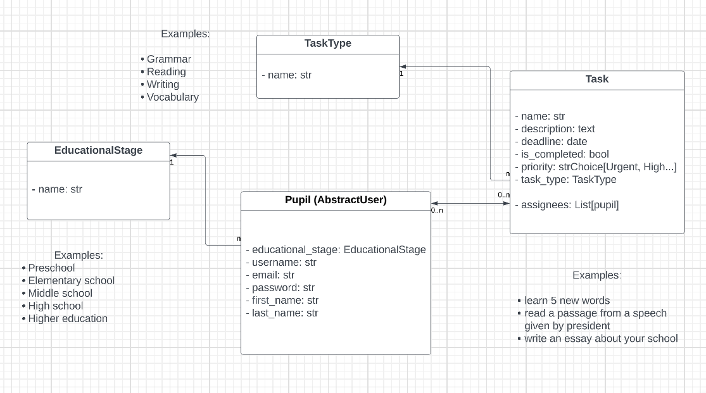
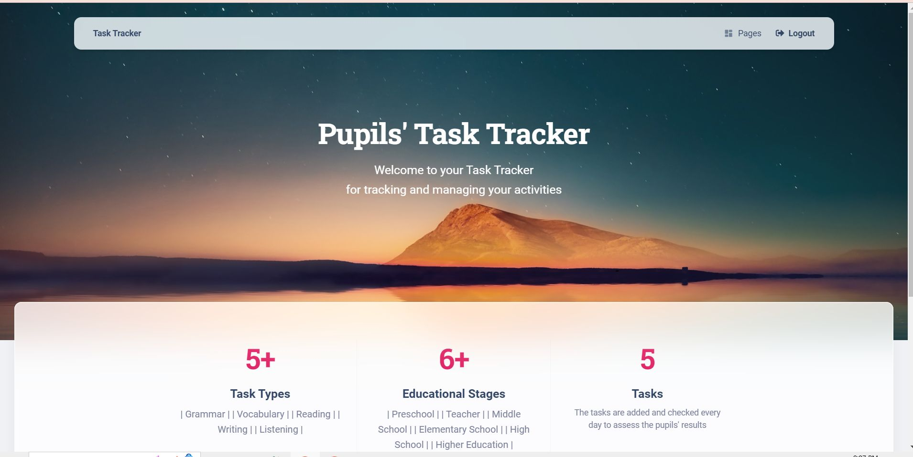

# Pupils' task tracker

A task tracker is an intelligent version of a to-do list that can help manage tasks and assignments.

I've implemented the basic task tracker for pupils of different educational stages and a teacher to follow their daily
activities, assigning new tasks and checking completion. 

As for the tutor it would be a nice possibility to track the performance of each individually and by stages.

To put it simply, task trackers help pupils and teachers keep track of what tasks are completed and what is still waiting.




## Check it out


## Installation

Python3 must be already installed


```bash
git clone https://github.com/ViktorKrUA/pupil-task-tracker.git
cd pupil-task-tracker
python3 -m venv venv
source venv/bin/activate
pip install -r requirements.txt
python manage.py migrate
python manage.py runserver # starts Django Server
```


## Features

- Authentication for pupil/teacher
- Managing pupils, educational stages, task types and tasks directly from the website interface
- Powerful admin panel for advanced managing


## Demo

Use the following command to load prepared data from fixture to get demo access to the system:

python manage.py loaddata pupil_task_tracker_db_data.json

After loading data from fixture you can use following superuser (or create another one by yourself):

Login: Test
Password: higher123

After cloning, you need to create your .env file and register your variables in it. After that, everything will work. For an example, see the file .env.sample

## Screenshots


